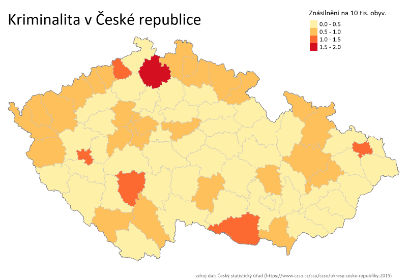
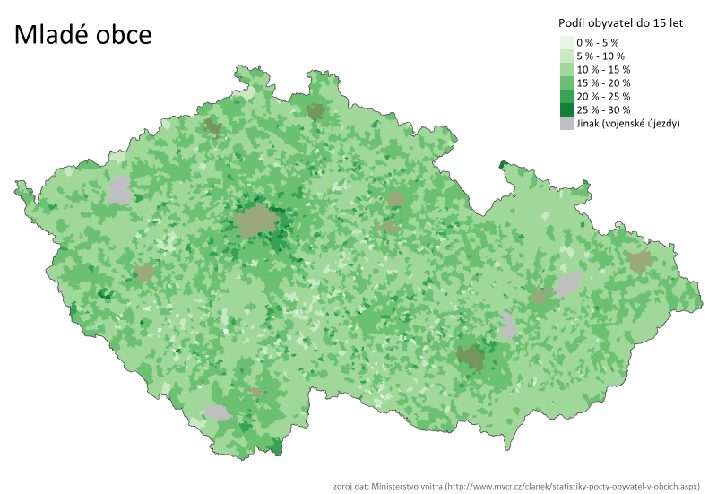

# RCzechia  [](https://travis-ci.org/jlacko/RCzechia)

This project creates a set of shapefiles (or rather Large SpatialPolygonDataFrames in R) relevant to the Czech Republic. The description will therefore continue in the Czech language.
- - - - - 
Cílem mého snažení bylo připravit set objektů pro snazší práci s geografickými daty o České republice v rámci R. 

K dispozici sice je Arc500 (https://www.arcdata.cz/produkty/geograficka-data/arccr-500) se kterým se z Rka dá přes [rgdal](https://cran.r-project.org/web/packages/rgdal/index.html) docela dobře pracovat, ale není to ani úplně uživatelsky vstřícné ani triviální (například způsob kódování češtiny jsem vůbec nepochopil). Shapefily jsem trochu upravil pro snazší práci v R.

Souřadnicový systém je převedený z Křováka na WGS84, které se více kamarádí s google aplikacemi a ggplot2. Zastaralá a nadbytečná datová pole jsem odstranil, populaci okresů a obcí naopak aktualizoval k 1.1.2017. Počty obvyvatel jsou:  
1) celkové a  
2) patnáct plus.

Pro práci s daty velmi doporučuju package `tmaptools`. Zejména funkce `append_data` pro připojení datových polí přes klíče je k nezaplacení.

Package obsahuje tyto Large Spatial objekty:
* **republika**: Large SpatialPolygonDataFrame. Hranice České republiky.
* **okresy**: Large SpatialPolygonDataFrame. 76 okresů České republiky + Praha. Název okresu je v diakritické češtině.
Klíč pro připojení dat je KOD_LAU1 (kód okresu).
* **obce_polygony**: Large SpatialPolygonDataFrame. Obce a vojenské újezdy České republiky. Název obce je v diakritické češtině.  
Klíč pro připojení dalších dat je  KOD_OBEC, v data frame jsou navíc informace o příslušné obci s pověřeným obecním úřadem (tzv. dvojkové obce - KOD_POV, respektive PovObec) a příslušné obci s rozšířenou působností (tzv. trojkové obce - KOD_ROZ, respektive RozObec).
* **obce_body** stejné jako obce polygony, ale pouze středy (Large SpatialPointsDataFrame). Výrazně menší a k paměti vstřícnější než polygony.
* **orp_polygony** Large SpatialPolygonDataFrame. Obce s rozšířenou působností (trojkové obce). Klíč připojení dat je KOD_ORP. Název ORP je v diakritické češtině.  
* **reky**: Large SpatialLinesDataFrame. Řeky České republiky. Přidáním do mapy pomohou základní orientaci. Název řeky je v ASCII cestine. 
* **plochy**: Large SpatialPolygonDataFrame. Vodní plochy České republiky. Přidáním do mapy pomohou základní orientaci. Název vodní plochy je v ASCII cestine.  

Shapefily vycházejí z Arc500, ©ArcČR, ARCDATA PRAHA, ZÚ, ČSÚ, 2016

## Instalace  
``` R
install.packages("devtools")  
devtools::install_github("jlacko/RCzechia")
```

## Příklady použití
### Příklad první: kriminalita (počet znásilnění na 10 000 obyvatel) v okresech ČR
``` R
# Nastavení prostředí ----

library(tmap)
library(tmaptools)
library(RCzechia)
library(raster)

bbox <- extent(republika) # trochu víc místa nahoře a dole, aby se vešel nadpis & legenda
bbox@ymax <- bbox@ymax + 0.35
bbox@ymin <- bbox@ymin - 0.15

# Data o kriminalitě ----

#zdroj dat = CZSO, období = rok 2015 (poslední známé). Data nejsou přiložena.
frmData <- read.csv2("OkresniData.txt", sep="\t", header = TRUE, encoding = "UTF-8")

# použití funkce tmaptools::append_data je zcela klíčové; jedině díky klíči jsou data konzistentní.
okresy <- append_data(okresy, frmData, key.shp = "KOD_LAU1", key.data = "LAU1")

# počet znásilnění na deset tisíc obyvatel
okresy$Res <- okresy$Rape / (okresy$Obyvatel/10000)
nadpis <- "Znásilnění na 10 tis. obyv." # nadpis legendy
endCredits <- "zdroj dat: Český statistický úřad (https://www.czso.cz/csu/czso/okresy-ceske-republiky-2015)"


# vlastí kreslení... ----

plot <- tm_shape(republika, bbox = bbox)+tm_borders("grey30", lwd = 1) +
  tm_shape(okresy, bbox = bbox)+tm_fill(col = "Res", palette = "YlOrRd", title = nadpis)+
  tm_shape(okresy, bbox = bbox)+tm_borders("grey75", lwd = 0.25)+
  tm_style_white("Kriminalita v České republice",frame = F, fontfamily = "Calibri", 
  legend.text.size = 0.5, legend.title.size = 0.7, legend.format = list(text.separator=  "-"))+
  tm_credits(endCredits, position = c("RIGHT", "BOTTOM"), size = 0.4, col = "grey35")

save_tmap(plot , filename = "krimi.png", width = 1600)
```


Zdá se, že po odchodu německy hovořícího obyvatelstva ze Sudet zůstala v kraji pachuť násilí...

### Příklad druhý: podíl dětí (obyvatel do 15 let) z celkového počtu obyvatel obcí ČR

``` R
# Nastavení prostředí ----

library(tmap)
library(tmaptools)
library(RCzechia)
library(raster)

bbox <- extent(republika) # trochu víc místa nahoře a dole, aby se vešel nadpis legenda
bbox@ymax <- bbox@ymax + 0.35
bbox@ymin <- bbox@ymin - 0.15


wrkObce <- obce[obce$Obyvatel > 80000, ] # bez Pardubic by to nebylo ono...

# Mládí vpřed - podíl osob do 14 let na celkových... ----

obce$Res <- 100*(obce$Obyvatel - obce$Obyvatel15p)/obce$Obyvatel
nadpis <- "Podíl obyvatel do 15 let (%)" # nadpis legendy
endCredits <- "zdroj dat: Ministerstvo vnitra (http://www.mvcr.cz/clanek/statistiky-pocty-obyvatel-v-obcich.aspx)"


# vlastí kreslení... ----

plot <- tm_shape(republika, bbox = bbox)+tm_borders("grey30", lwd = 1) +
  tm_shape(obce)+tm_fill(col = "Res", palette = "Greens", title = nadpis, textNA = "Jinak (vojenské újezdy)", legend.format=list(fun=function(x) paste0(formatC(x, digits=0, format="f"), " %")))+
  tm_shape(wrkObce)+tm_fill("firebrick4", alpha = 0.25)+
  tm_style_white("Mladé obce",frame = F, fontfamily = "Calibri", legend.text.size = 0.5, legend.title.size = 0.7, legend.format =  list(text.separator=  "-"))+
  tm_credits(endCredits, position = c("RIGHT", "BOTTOM"), size = 0.4, col = "grey35")

save_tmap(plot, filename = "mladi.png", width = 1600, type = "cairo")
```


Je vidět, že rodiny s dětmi mizí z Vysočiny a rozhraní jižních a středních Čech, a stěhují se do okolí Prahy.
