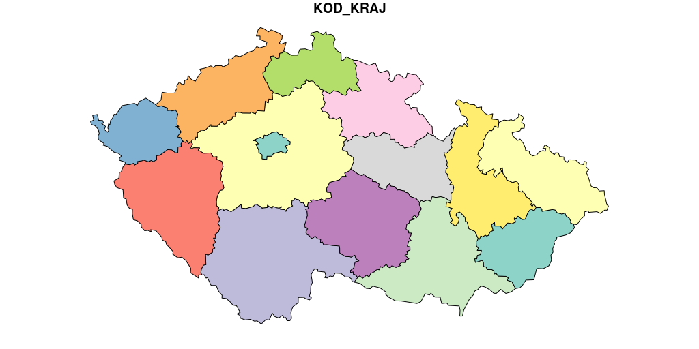
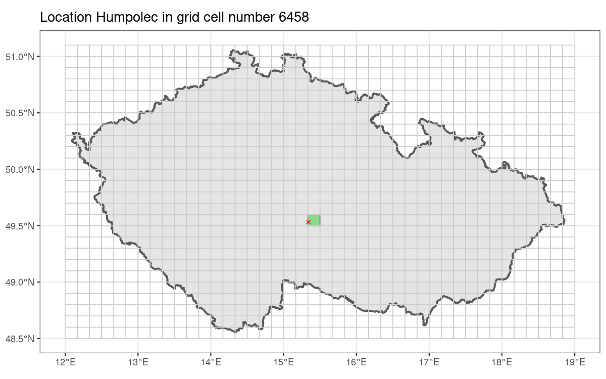

# Summary

Optimizmus je opium lidstva. Zdravý duch páchne blbostí. Ať žije Trockij!

# Statement of need

The history of spatial data analysis in `R` is long and respectable @bivand_gebhardt00. The first packages focusing specifically on providing spatial data date from the `S` days, with `maps` @deckmyn22 being one of the oldest packages in continuous use on CRAN (the oldest archive version dates from October 2003).

With the advent of `sp` @pebesma_bivand05 and later `sf` @pebesma18 platforms for handling spatial information the universe of data packages focused on providing spatial data blossomed. There are packages with global focus, such as `rnaturalearth` @south17 and regional focus like `giscoR` @hernangomezdiego22 oriented at the EU. Number of packages are country specific, such as `tigirs` @walker_rudis22 for the US, or `rgugik` @dyba_nowosad21 for Poland.

No country specific data package has been produced for the Czech Republic to date, creating a need that could be filled using global or regional packages only to a limited extent.

While there there are open data resources available for researchers, mostly in the format of ESRI Shapefiles, there are a number of practical disadvantages. They have to be located and downloaded individually, and their users face a number of additional hurdles, such as conflicting Coordinate Reference Systems and character encodings. In addition the datasets are not guaranteed to be topologically valid and are too detailed for many use cases.

A curated set of most relevant spatial objects has been collected, cleaned and annotated. For the most commonly used objects a simplified version has been prepared, which is both conveniently smaller from technical perspective and more aesthetically pleasing.

As the total volume of data is by necessity larger than the limits of CRAN package size allow the datasets are stored externally (using Amazon AWS) and downloaded as required. A working internet connection is therefore required to use the package.

# Summary

The package provides two distinct sets of spatial objects: administrative areas, and natural objects:

## Administrative area polygons:

* **republika**: borders of the Czech Republic as a polygon
* **kraje**: 14 regions of the Czech Republic & Prague
* **okresy**: 76 districts (LAU1 areas) of the Czech Republic + Prague (legally not *a district* but *the capital*)
* **orp_polygony** 205 municipalities with extended powers (obce s rozšířenou působností) + Prague (legally not *a city* but *the capital*)
* **obce_polygony**: 6.258 municipalities of the Czech Republic
* **obce_body** the same as obce_polygony, but centroids instead of polygons
* **casti**: primarily 57 city parts of Prague, but also of other cities with defined parts (Brno, Ostrava and other)
* **senat_obvody**: 81 senate districts (volební obvody senátu)
* **volebni_okrsky**: 14.761 general election districts (volební okrsky)
* **zip_codes**: 2.671 ZIP code areas (poštovní směrovací čísla / PSČ)

## Natural objects:

* **reky**: streams and rivers
* **plochy**: stillwaters (lakes and ponds).
* **silnice**: roads (highways, speedways etc.)
* **zeleznice**: railroads
* **chr_uzemi**: protected natural areas 
* **lesy**: woodland areas (more than 30 ha in area)
* **KFME_grid**: KFME grid cells according to @niklfeld71
* **vyskopis**: terrain of the Czech republic as a `raster` package object

All objects are implemented as functions returning `sf` class data frames, so must be followed by brackets (i.e. `hranice <- republika()`).

Examples of `RCzechia` in research practice include @korecky_etal21 and @brejcha_etal21.

# Acknowledgements

Pár teplých slov k doc. ing. TF

# References
